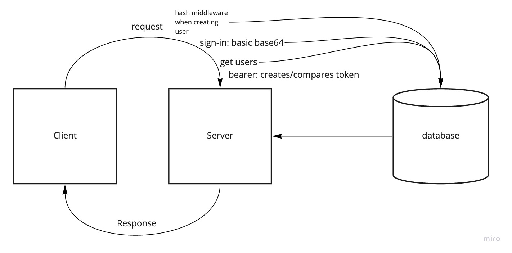

# bearer-auth

## Current LAB - 07

## Bearer Authorization

At this point, our auth-server is able to allow a user to create an account as well as to handle Basic Authentication (user provides a username + password). When a “good” login happens, the user is considered to be “authenticated” and our auth-server generates a JWT signed “Token” which is returned to the application

We will now be using that Token to re-authenticate users to shield access to any route that requires a valid login to access.

### Author: Mark Thanadabouth

### Collaborators: Jeremy B, Lorenzo O, Ayrat G

#### Links and Resources
[Deployed Link](https://mt-bearer-auth-dev.herokuapp.com/)

### Setup

#### `.env` requirements
- `PORT` - \<reference sample.env>
- `DATABASE_URL` - \<reference sample.env>
- `SECRET` - \<reference sample.env>

#### Running App
- `npm start` or `nodemon`

Endpoints:
- .get `/`
> "Bearer Server Lab"
- .post `/signup`
> Post user and password to database
- .post `/signin`
> Post a success if login is valid
- .get `/users`
> Gets all users using token

#### Tests
- `npm test`

### UML
<!-- >  -->

### Reflections and Comments
* Start date (10/16)
* This lab was pretty tough

### LAB - 07

Name of feature: Phase 2

Estimate of time needed to complete: 12 Hours

Start time: 2pm(10/16)

Finish time: 8pm(10/19)

Actual time needed to complete: 20 hours
